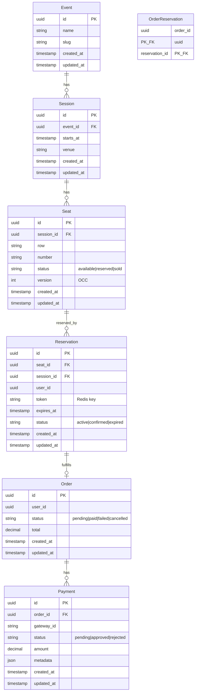

# Sistema de Venda de Ingressos de Alta Disponibilidade

<p align="center">
  <a href="http://nestjs.com/" target="blank"></a>
</p>

Sistema de venda de ingressos preparado para **picos massivos de tráfego (burst traffic)** e **zero overselling** (nunca vender o mesmo assento duas vezes). Arquitetura event-driven em monólito modular NestJS, com locks distribuídos, TTL de reserva e integração com gateway de pagamento via webhooks.

---

## Índice

- [Descrição](#descrição)
- [Arquitetura](#arquitetura)
- [Stack e dependências](#stack-e-dependências)
- [Modelo de dados (ERD)](#modelo-de-dados-erd)
- [Gestão de concorrência](#gestão-de-concorrência)
- [Fluxo de checkout e TTL](#fluxo-de-checkout-e-ttl)
- [Thundering herd e escalabilidade](#thundering-herd-e-escalabilidade)
- [Integração com gateway de pagamento (webhooks)](#integração-com-gateway-de-pagamento-webhooks)
- [Estrutura do projeto](#estrutura-do-projeto)
- [Pré-requisitos e configuração](#pré-requisitos-e-configuração)
  - [Docker Compose](#docker-compose)
  - [Migrations](#migrations)
- [API](#api)
- [Testes](#testes)
- [Recursos](#recursos)
- [Licença](#licença)

---

## Descrição

O sistema cobre:

- **Catálogo**: eventos, sessões e assentos (inventário).
- **Reserva**: reserva de assento com lock distribuído (Redis), TTL de 10 minutos no Redis e persistência em PostgreSQL com controle de concorrência otimista (OCC).
- **Checkout**: reserva temporária; se o pagamento não for confirmado no prazo, o assento volta a ficar disponível.
- **Pagamento**: recebimento de confirmação do gateway via webhook (assinatura HMAC), processamento assíncrono em fila e atualização de reserva/assento para vendido.

Eventos de domínio (`SeatReserved`, `ReservationExpired`, `PaymentConfirmed`) são publicados via EventEmitter2, permitindo evoluir para mensageria externa (Redis Streams, RabbitMQ) e extração para microsserviços no futuro.

---

## Arquitetura

Arquitetura **event-driven** em **monólito modular**, com bounded contexts bem definidos:

| Contexto      | Responsabilidade                                      |
|---------------|--------------------------------------------------------|
| **Catalog**   | Eventos, sessões, assentos; repositório de assentos (OCC). |
| **Reservation** | Reserva com lock + TTL, expiração por cron, confirmação pós-pagamento. |
| **Payment**   | Webhook do gateway, fila de processamento, confirmação de reservas. |

A comunicação entre contextos é feita por **eventos de domínio** e por **chamadas diretas** aos serviços exportados (ex.: Payment chama Reservation para confirmar). A infraestrutura compartilhada (Redis, PostgreSQL, BullMQ, EventEmitter) fica no `InfrastructureModule`.

---

## Stack e dependências

| Camada              | Tecnologia |
|---------------------|------------|
| API / orquestração  | NestJS 11, TypeScript, Express |
| Persistência        | PostgreSQL, TypeORM |
| Cache, locks, filas | Redis, BullMQ, ioredis |
| Eventos             | @nestjs/event-emitter (EventEmitter2) |
| Validação           | class-validator, class-transformer |
| Agendamento         | @nestjs/schedule (cron) |
| Rate limiting       | @nestjs/throttler |

---

## Modelo de dados (ERD)



- **Event**: show/jogo.
- **Session**: data/horário do evento em um local.
- **Seat**: assento com `status` e `version` (OCC).
- **Reservation**: reserva com TTL (`expires_at`), `token` (vínculo com Redis).
- **Order**: pedido; associado a reservas via `order_reservations`.
- **Payment**: tentativa de pagamento; confirmação via webhook atualiza Order e Reservations.

---

## Gestão de concorrência

Para evitar **overselling**, o sistema usa:

1. **Distributed lock (Redis)**  
   Chave por assento: `lock:reservation:{sessionId}:{seatId}`. Apenas um processo altera o assento por vez. Lock com TTL (ex.: 5 s) para evitar deadlock.

2. **Otimistic Concurrency Control (OCC)**  
   A tabela `seats` tem `version`. A reserva só é aplicada com:
   `UPDATE seats SET status = 'reserved', version = version + 1 WHERE id = ? AND version = ? AND status = 'available'`.  
   Se nenhuma linha for afetada, há conflito (outro processo reservou); a reserva é abortada e o lock liberado.

3. **Idempotência**  
   Reservas podem enviar `idempotencyKey`. O resultado da primeira execução é guardado no Redis; requisições repetidas retornam o mesmo resultado sem nova reserva.

Fluxo resumido da reserva:

1. (Opcional) Consultar idempotency no Redis; se existir, retornar resultado anterior.
2. Adquirir lock Redis para o assento.
3. Buscar assento no DB; se não existir ou não estiver `available`, liberar lock e retornar erro.
4. Criar entrada no Redis com TTL 10 min (`reservation:{token}`).
5. Inserir `Reservation` e atualizar `Seat` com OCC; em caso de conflito, remover key no Redis, liberar lock e retornar erro.
6. Publicar evento `SeatReserved` e liberar lock.

---

## Fluxo de checkout e TTL

- Ao **reservar**: é criado registro em PostgreSQL (`Reservation` com `expires_at = now() + 10 min`) e uma key no Redis com TTL de **10 minutos** (600 s), configurável por `RESERVATION_TTL_SECONDS`.
- **Expiração**: um job cron (a cada minuto) busca reservas com `status = 'active'` e `expires_at < now()`, chama `releaseReservation` para cada uma (remove key Redis, atualiza `Seat` para `available`, `Reservation` para `expired`) e publica `ReservationExpired`.
- **Pagamento aprovado**: o webhook enfileira o evento; o worker atualiza `Payment`, `Order`, confirma as reservas (status `confirmed`, assento `sold`), remove as keys de reserva no Redis e publica `PaymentConfirmed`. O assento não depende só do TTL para “liberar”; a confirmação de pagamento fecha o ciclo.

---

## Thundering herd e escalabilidade

Na abertura das vendas, muitos requests simultâneos podem bater no mesmo assento e no banco. O sistema mitiga com:

1. **Rate limiting**  
   Throttler global: 5 requisições por 60 segundos por IP (configurável). Reduz abuso e saturação por um único cliente.

2. **Fila de reservas**  
   `POST /reservations` não chama o serviço de reserva diretamente; envia um job para a fila BullMQ `reservation`. Workers processam em ordem; cada reserva usa lock por assento, então o paralelismo é por assento, não por evento inteiro.

3. **Resposta HTTP**  
   O controller espera até 15 s pelo resultado do job. Se o job não concluir a tempo, responde **503 Service Unavailable** com mensagem para tentar novamente.

4. **Lock granular**  
   Lock por `sessionId + seatId`, permitindo que vários assentos sejam reservados em paralelo por workers diferentes.

### Workers e filas em produção

Em produção, recomenda-se separar a responsabilidade entre API e processamento assíncrono:

- API HTTP: containers focados em atender requisições REST (rotas `/catalog`, `/reservations`, `/orders`, `/webhooks/payments`, etc.).
- Workers BullMQ: containers com a mesma imagem, mas com foco em processar filas:
  - Fila `reservation` (reservas de assentos).
  - Fila `payment-webhook` (confirmação de pagamento via webhook).
  - `ReservationExpirationService` (cron de expiração) rodando em pelo menos uma instância.

A escala pode ser feita assim:

- Aumentar o número de réplicas da API conforme throughput HTTP.
- Aumentar o número de réplicas dos workers conforme volume de jobs nas filas.

As filas estão configuradas com:

- `reservation`: tentativa única (o controller devolve 503 em timeout).
- `payment-webhook`: 3 tentativas com backoff exponencial.

Para cenários mais críticos, recomenda-se configurar uma dead-letter queue (DLQ) e monitorar jobs falhos nas filas.

---

## Integração com gateway de pagamento (webhooks)

### Endpoint

- `POST /webhooks/payments/:provider`  
  Ex.: `POST /webhooks/payments/stripe`. O `:provider` é informativo (Stripe, Mercado Pago, etc.).

### Segurança

- **Assinatura**: header `X-Webhook-Signature: sha256=<hex>`, onde `<hex>` é HMAC-SHA256 do **body bruto** da requisição com o segredo configurado em `WEBHOOK_PAYMENT_SECRET`.
- Requisições sem assinatura ou com assinatura inválida recebem **401 Unauthorized**.
- O body deve ser o JSON bruto (o app usa raw body para calcular o HMAC).

### Fluxo

1. Controller valida a assinatura (guard).
2. Enfileira um job na fila `payment-webhook` com o payload (ex.: `eventType`, `gatewayId`).
3. Responde **200 OK** com `{ "received": true }` para o gateway não reenviar por timeout.
4. Worker processa o job: se `eventType === 'payment.approved'`, busca `Payment` por `gateway_id`; se já estiver `approved`, ignora (idempotência); senão atualiza Payment/Order, confirma reservas e assentos, remove keys no Redis e publica eventos.

### Payload esperado (exemplo)

```json
{
  "eventType": "payment.approved",
  "gatewayId": "pay_xxx"
}
```

O gateway real pode enviar outro formato; o worker deve ser adaptado para deserializar o evento do provider (Stripe, etc.) e extrair `gatewayId` e tipo de evento.

### Retries

Jobs da fila usam 3 tentativas com backoff exponencial. Falhas persistentes podem ser enviadas para dead-letter e alertas.

---

## Estrutura do projeto

```
src/
├── app.module.ts
├── main.ts
├── config/
│   ├── configuration.ts    # Factory de config (env)
│   └── index.ts
├── infrastructure/
│   ├── infrastructure.module.ts
│   ├── database/           # TypeORM + PostgreSQL
│   ├── redis/              # Cliente Redis global
│   └── queue/               # BullMQ (reservation, payment-webhook, reservation-expiration)
└── modules/
    ├── catalog/
    │   ├── domain/         # Event, Session, Seat, ISeatRepository
    │   ├── application/    # CatalogController
    │   └── infrastructure/ # SeatRepository (TypeORM)
    ├── reservation/
    │   ├── domain/         # Reservation, interfaces (lock, cache, events), DTOs de request/result
    │   ├── application/    # ReservationService, ReservationController, ReservationExpirationService
    │   └── infrastructure/ # DistributedLockService, ReservationCacheService, repositories, processors
    └── payment/
        ├── domain/         # Order, Payment, OrderReservation
        ├── application/    # PaymentWebhookService, PaymentConfirmationService, WebhookSignatureGuard
        ├── infrastructure/ # Repositories, PaymentWebhookProcessor
        └── webhooks/        # PaymentWebhookController
```

---

## Pré-requisitos e configuração

### Pré-requisitos

- **Node.js** 18+
- **PostgreSQL** (ex.: 14+)
- **Redis** (ex.: 6+)

### Docker Compose

Para subir PostgreSQL e Redis localmente com um único comando:

```bash
# sobe os serviços em background (postgres na 5432, redis na 6379)
npm run docker:up
# ou
docker compose up -d
```

O Compose cria o banco `tickets` automaticamente (variável `POSTGRES_DB=tickets`). Se a porta 5432 ou 6379 já estiver em uso, pare o serviço local ou altere o mapeamento em `docker-compose.yml`.

```bash
# derruba os containers
npm run docker:down
```

### Migrations

O schema do banco é controlado por **migrations** TypeORM (o app não usa `synchronize`). Após subir o Postgres (Docker ou local) e criar o banco (se não usou Docker):

```bash
# compila e aplica todas as migrations pendentes
npm run migration:run
```

Para reverter a última migration:

```bash
npm run migration:revert
```

Migrations ficam em `src/infrastructure/database/migrations/`. A primeira migration (`InitialSchema`) cria as tabelas: `events`, `sessions`, `seats`, `reservations`, `orders`, `payments`, `order_reservations`.

#### Migrations e backups em produção

Em produção, recomenda-se:

- Executar migrations como parte da pipeline de deploy (CI/CD), antes de subir a nova versão da aplicação.
- Garantir que as migrations sejam **compatíveis** com a versão anterior do código (evitando breaking changes imediatas em colunas usadas pela versão anterior).
- Realizar **backup automático** do banco antes de migrations críticas (ex.: alterações em colunas grandes ou dados históricos).
- Testar o fluxo de `migration:run` e `migration:revert` em um ambiente de staging com dados próximos aos de produção.

Para bancos gerenciados (RDS, Cloud SQL etc.), configure:

- Backups automáticos diários, com retenção adequada ao negócio.
- Point-in-time recovery habilitado (quando disponível) para recuperar o estado do banco em caso de migrations problemáticas.

### Variáveis de ambiente

Copie `.env.example` para `.env` e ajuste:

| Variável | Descrição | Default |
|----------|------------|---------|
| `PORT` | Porta HTTP | `3000` |
| `DATABASE_HOST` | Host PostgreSQL | `localhost` |
| `DATABASE_PORT` | Porta PostgreSQL | `5432` |
| `DATABASE_USERNAME` | Usuário | `postgres` |
| `DATABASE_PASSWORD` | Senha | `postgres` |
| `DATABASE_NAME` | Nome do banco | `tickets` |
| `REDIS_HOST` | Host Redis | `localhost` |
| `REDIS_PORT` | Porta Redis | `6379` |
| `REDIS_PASSWORD` | Senha Redis (opcional) | - |
| `RESERVATION_TTL_SECONDS` | TTL da reserva no Redis (segundos) | `600` (10 min) |
| `RESERVATION_LOCK_TTL_MS` | TTL do lock de reserva (ms) | `5000` |
| `WEBHOOK_PAYMENT_SECRET` | Segredo para assinatura do webhook | (obrigatório em produção) |
| `JWT_SECRET` | Segredo para assinatura do JWT | (obrigatório em produção) |
| `JWT_EXPIRES_IN` | Validade do token (ex.: 1d, 7d) | `1d` |
| `ADMIN_EMAIL` | Email do admin para seed (opcional) | - |
| `ADMIN_PASSWORD` | Senha do admin para seed (opcional) | - |

### Criar o banco (se não usar Docker)

Se estiver usando PostgreSQL local (e não o do Docker Compose), crie o banco:

```bash
createdb tickets
```

Ou no PostgreSQL:

```sql
CREATE DATABASE tickets;
```

### Instalação

```bash
npm install
```

### Executar

```bash
# desenvolvimento (watch)
npm run start:dev

# produção (build + node)
npm run build && npm run start:prod
```

A API sobe em `http://localhost:3000` (ou na porta definida em `PORT`).

### Deploy em produção (exemplo Kubernetes)

Para um ambiente de produção, recomenda-se:

- API rodando em containers a partir da imagem construída pelo `Dockerfile`
- PostgreSQL e Redis como serviços gerenciados (RDS/Cloud SQL, ElastiCache, etc.)
- Reverse proxy / ingress controlando HTTPS, timeouts e limites

Este repositório inclui manifests de exemplo em `deploy/kubernetes`:

- `tickets-api-deployment.yaml`: `Deployment` da API com 3 réplicas, probes de liveness/readiness e variáveis de ambiente vindas de `Secrets`
- `tickets-api-service.yaml`: `Service` interno expondo a API na porta 80 dentro do cluster
- `tickets-api-ingress.yaml`: `Ingress` NGINX expondo a API em `tickets.example.com` com TLS

Esses manifests devem ser adaptados para o seu provedor de nuvem (nome da imagem, Secrets, domínio, certificados TLS etc.) e aplicados via:

```bash
kubectl apply -f deploy/kubernetes/
```

---

## API

Documentação interativa (Swagger UI) disponível em:

- **http://localhost:3000/api/docs**

É possível testar as rotas protegidas informando o JWT em *Authorize* (Bearer token).

Coleção **Postman** em `postman/Tickets-API.postman_collection.json`. Importe no Postman; após fazer **Auth > Login**, o token é salvo automaticamente na variável `access_token` para as demais requisições. Defina `eventId`, `sessionId`, `seatId`, `ticketId` nas variáveis da coleção quando necessário.

### Smoke (health)

| Método | URL | Descrição |
|--------|-----|-----------|
| GET | `/` | Resposta simples do app (ex.: "Hello World!") |
| GET | `/catalog/test` | Smoke do módulo Catalog |
| GET | `/reservations/test` | Smoke do módulo Reservation |
| GET | `/webhooks/payments/test` | Smoke do módulo Payment (webhooks) |

### Auth

| Método | URL | Descrição |
|--------|-----|-----------|
| POST | `/auth/login` | Login (retorna JWT). Body: `{ "email", "password" }`. |
| POST | `/auth/register` | Cadastro de usuário. Body: `{ "email", "password" }` (password mínimo 6 caracteres). Retorna JWT. Email já existente: **409 Conflict**. |

**Resposta login/register (200/201):** `{ "access_token": "jwt...", "expires_in": "1d" }`.

### Usuário (JWT obrigatório)

| Método | URL | Descrição |
|--------|-----|-----------|
| GET | `/users/me` | Retorna o usuário logado: `{ id, email, role }`. |

### Admin (JWT + roles)

As rotas de admin exigem header `Authorization: Bearer <access_token>` e um dos **roles**: `super_admin`, `event_manager`, `ticket_validator`. O primeiro admin (seed com `ADMIN_EMAIL`/`ADMIN_PASSWORD`) é criado como `super_admin`.

| Role | Permissões |
|------|------------|
| **super_admin** | Tudo: criar eventos, validar tickets QR, criar novos admins |
| **event_manager** | Criar/editar eventos, sessões e assentos |
| **ticket_validator** | Validar ingressos por QR code (portaria) |

| Método | URL | Roles | Descrição |
|--------|-----|-------|-----------|
| GET | `/admin/events` | todos | Listar eventos |
| POST | `/admin/events` | super_admin, event_manager | Criar evento |
| PATCH | `/admin/events/:id` | super_admin, event_manager | Atualizar evento |
| POST | `/admin/events/:eventId/sessions` | super_admin, event_manager | Criar sessão |
| PATCH | `/admin/sessions/:id` | super_admin, event_manager | Atualizar sessão |
| POST | `/admin/sessions/:sessionId/seats` | super_admin, event_manager | Criar assentos em lote |
| POST | `/admin/tickets/validate` | super_admin, ticket_validator | Validar ingresso por QR (body: `{ "qrPayload": "string" }`) |
| POST | `/admin/admins` | super_admin | Criar novo admin (body: `{ "email", "password", "adminType": "super_admin" \| "event_manager" \| "ticket_validator" }`) |

### Reservas (JWT obrigatório em POST)

| Método | URL | Descrição |
|--------|-----|-----------|
| POST | `/reservations` | Reservar um assento (requer JWT; o `userId` é obtido do token). Body JSON, rate limited e enfileirado. |

**Body (POST /reservations):**

```json
{
  "eventId": "uuid",
  "sessionId": "uuid",
  "seatId": "uuid",
  "idempotencyKey": "string opcional"
}
```

**Resposta de sucesso (200):**

```json
{
  "success": true,
  "reservationId": "uuid",
  "token": "string",
  "expiresAt": "ISO8601"
}
```

**Resposta de erro (200 com success false ou 503):**

```json
{
  "success": false,
  "error": "Seat not available"
}
```

Em caso de timeout da fila: **503 Service Unavailable**.

### Checkout (JWT obrigatório)

| Método | URL | Descrição |
|--------|-----|-----------|
| POST | `/orders` | Cria pedido a partir dos tokens de reserva. Body: `{ "reservationTokens": string[] }`. Valida que cada reserva existe, está ativa, pertence ao usuário e não expirou. Retorna `{ orderId, total }`. |

### Ingressos (JWT obrigatório)

| Método | URL | Descrição |
|--------|-----|-----------|
| GET | `/tickets` | Lista ingressos do usuário logado. |
| GET | `/tickets/:id` | Detalhe de um ingresso (apenas dono). |
| GET | `/tickets/:id/qr` | Retorna imagem PNG do QR do ingresso (apenas dono). |

### Webhook de pagamento

| Método | URL | Descrição |
|--------|-----|-----------|
| POST | `/webhooks/payments/:provider` | Receber notificação do gateway (header `X-Webhook-Signature` obrigatório) |

---

## Testes

```bash
# Testes unitários (sem PostgreSQL/Redis)
npm run test

# Testes e2e (exigem PostgreSQL e Redis; banco `tickets` deve existir)
npm run test:e2e

# Cobertura
npm run test:cov
```

- **Unit**: ex.: `ReservationService` com mocks (lock, cache, repositórios, event publisher).
- **E2E**: smoke dos controllers, validação de body em `POST /reservations`, rejeição de webhook sem assinatura.

### Testes em CI/CD e carga

Em uma pipeline de CI/CD típica, recomenda-se:

- Executar `npm run lint`, `npm run test` e `npm run test:e2e` a cada PR.
- Gerar relatório de cobertura com `npm run test:cov` e monitorar módulos críticos (reservation, payment, auth).
- Rodar testes e2e contra banco/Redis efêmeros (containers descartáveis).

Para testes de carga, use ferramentas como k6, Artillery ou Gatling para simular:

- Pico de reservas (`POST /reservations`) na abertura de vendas.
- Volume alto de webhooks de pagamento (`POST /webhooks/payments/:provider`).
- Fluxo completo de checkout (`/reservations` → `/orders`).

Os cenários de carga devem ser executados em um ambiente de staging o mais próximo possível de produção, com métricas ativas (latência, taxa de erro, consumo de CPU/memória) para calibrar limites de rate limiting, tamanho de instâncias e número de workers.

---

## Recursos

- [NestJS](https://docs.nestjs.com)
- [TypeORM](https://typeorm.io)
- [BullMQ](https://docs.bullmq.io)
- [NestJS Throttler](https://docs.nestjs.com/security/rate-limiting)

---

## Operação e runbooks

Alguns cenários comuns de operação:

- **Fila de reserva crescendo ou travada**  
  - Verificar o estado da fila `reservation` no Redis/BullMQ (jobs pendentes, falhos).
  - Aumentar o número de workers (réplicas) responsáveis pela fila.
  - Investigar logs de jobs falhos; se necessário, reprocessar jobs ou esvaziar a fila com cuidado.

- **Divergência entre pagamentos e reservas**  
  - Identificar pagamentos aprovados cujo `Payment`/`Order` não estão consistentes.
  - Reprocessar os eventos de pagamento (via reenvio de webhook ou job manual em `payment-webhook`).
  - Garantir que o processo de reconciliação respeite a idempotência (não vender o mesmo assento duas vezes).

- **Banco ou Redis indisponíveis**  
  - A aplicação passará a retornar erros 5xx em rotas dependentes; os health checks de readiness devem marcar a instância como `not ready`.
  - Atuar na infra (RDS/Redis gerenciado) para restaurar o serviço e, se necessário, promover réplicas.
  - Após a recuperação, monitorar as filas e o número de erros para validar a normalização do tráfego.

Rotinas administrativas sugeridas:

- Criação de admins iniciais via `ADMIN_EMAIL`/`ADMIN_PASSWORD` e posterior troca de senha em ambiente seguro.
- Limpeza ou arquivamento de dados antigos (reservas expiradas, pagamentos antigos) por meio de scripts ou jobs agendados.

---

## Licença

Nest is [MIT licensed](https://github.com/nestjs/nest/blob/master/LICENSE).

---

## Fluxo sugerido de CI/CD

Um fluxo típico de entrega contínua para este projeto pode seguir os passos:

1. **CI (pull request)**  
   - Instalar dependências (`npm install`).
   - Rodar linters (`npm run lint`).
   - Rodar testes unitários (`npm run test`) e e2e (`npm run test:e2e`).
   - Opcional: verificar cobertura mínima com `npm run test:cov`.

2. **Build da imagem**  
   - Build da imagem Docker usando o `Dockerfile` multi-stage.
   - Publicação da imagem em registry privado (`your-registry/tickets-api:<sha>`).

3. **Migrations controladas**  
   - Em ambiente de staging, rodar `npm run migration:run` apontando para o banco de staging.
   - Após validar, rodar migrations em produção com janela e observabilidade ativas.

4. **Rollout em produção**  
   - Atualizar o `Deployment` (ou equivalente) para usar a nova tag de imagem.
   - Utilizar rollout gradual (rolling update ou blue/green) com health checks (`/` e `/health/ready`) garantindo que apenas instâncias saudáveis recebam tráfego.

5. **Rollback**  
   - Em caso de problema crítico, voltar rapidamente para a imagem anterior.
   - Se necessário, reverter migrations problemáticas com `npm run migration:revert` (desde que sejam reversíveis e planejadas para isso).

Esse fluxo pode ser implementado em GitHub Actions, GitLab CI, CircleCI ou outro serviço similar, respeitando as mesmas etapas lógicas.
